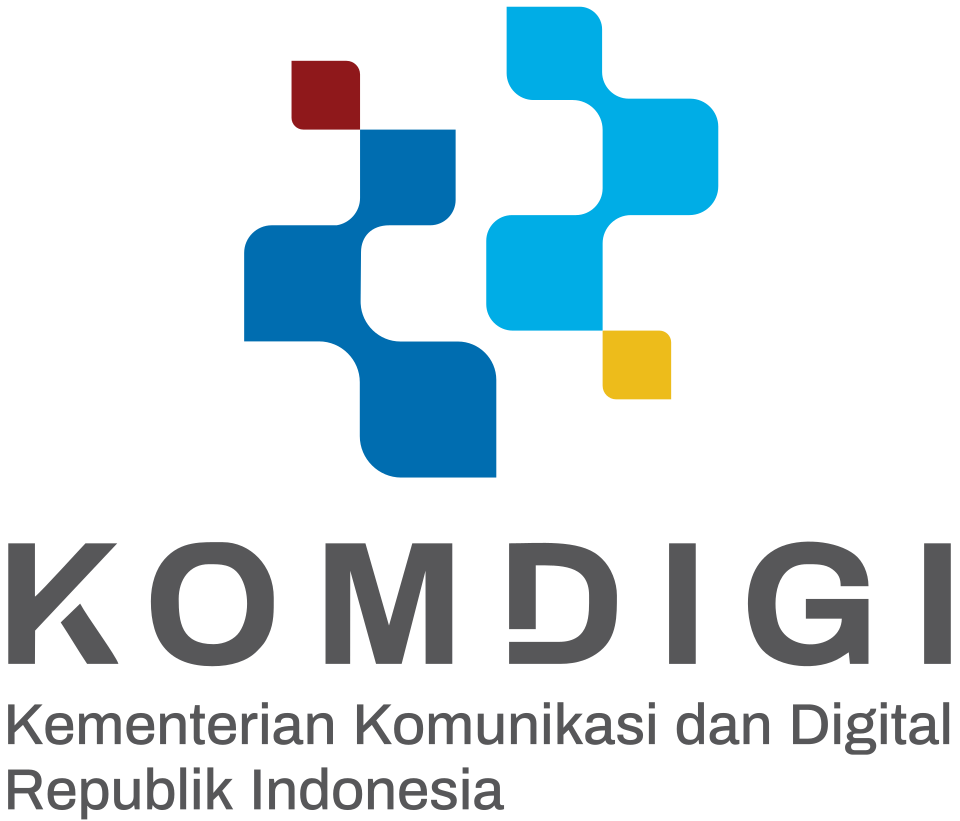
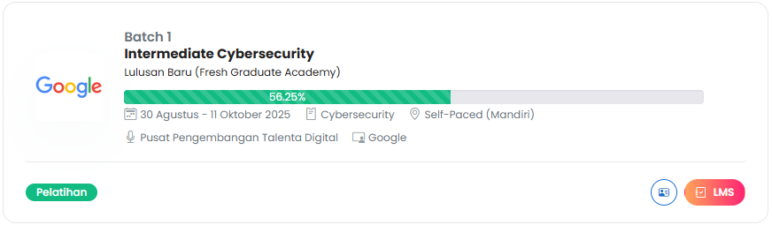

<h1 align="center">FGA - Intermediete CyberSecurity </h1>

	
	&nbsp;&nbsp;&nbsp;
	
	&nbsp;&nbsp;&nbsp;
	

---

## Tentang
Repositori ini menyimpan sertifikat dan portofolio tugas dari program CyberSecurity Intermediate (Digitalent) yang selaras dengan Google Cybersecurity Professional Certificate. Sifatnya arsip belajar dan bukti kompetensi.

## Struktur Singkat
- `Sertifikat/` — PDF sertifikat yang sudah diraih.
- `Portofolio/` — laporan, kode/skrip, notebook, atau artefak proyek/praktikum.
- `Tugas/` — submission dan bahan latihan tiap modul.

## Navigasi Cepat
- [Folder Sertifikat](./Sertifikat/)
- [Folder Portofolio](./Portofolio/)
- [Folder Tugas](./Tugas/)

## Progres Pelatihan

	
  

Kartu progres di atas akan diperbarui secara berkala sesuai perkembangan belajar.

## Status
Aktif dan diperbarui bertahap. Terakhir diperbarui: 2025-09-16.

## Catatan
Beberapa materi bisa tidak dipublikasikan jika berisi data sensitif atau terikat lisensi. Artefak yang aman untuk dibagikan akan diunggah seiring progres.
